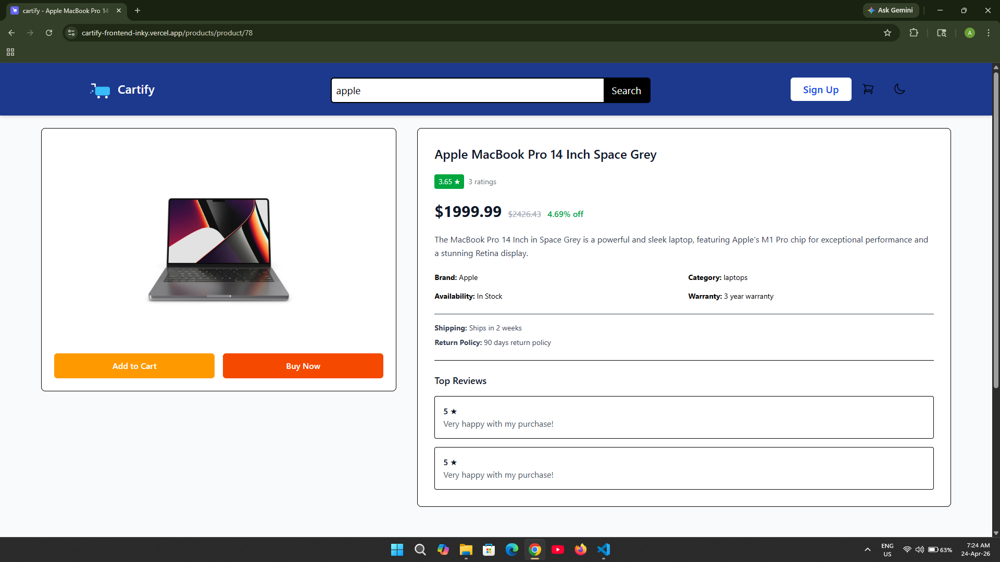
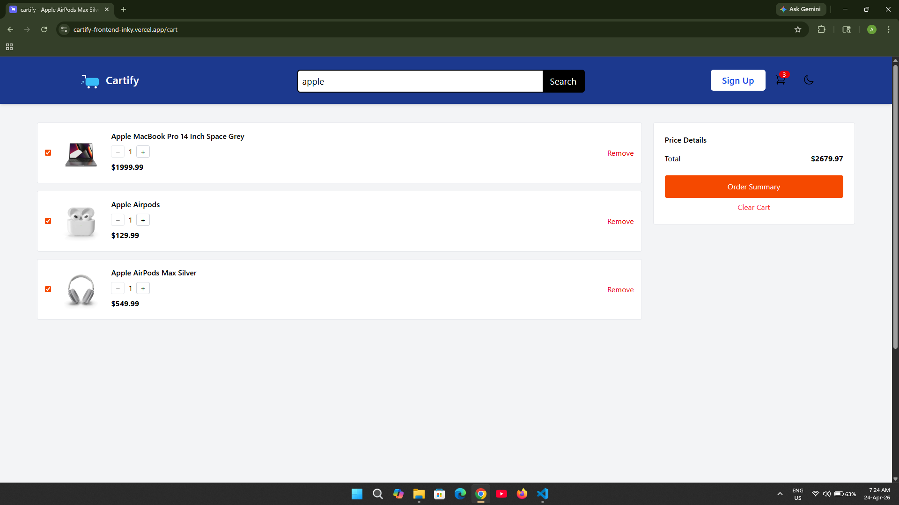
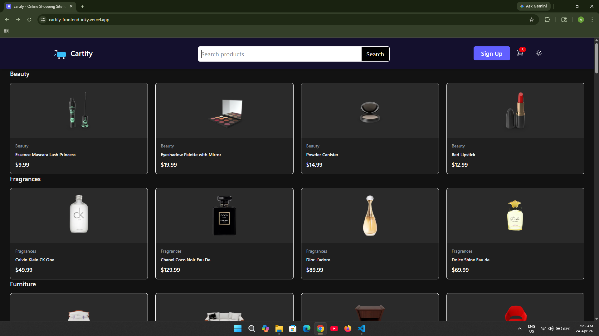

# Cartify – E-commerce Frontend Application

Cartify is a frontend-focused e-commerce application built to demonstrate real-world state management, scalable component structure, and responsive UI design.

## 🔗 Live Demo

👉 https://cartify-frontend-inky.vercel.app/

---

## 📌 Overview

Cartify simulates a modern shopping experience where users can browse products and manage a cart with real-time updates.
The project focuses on **clean architecture, predictable state management, and performance-conscious UI rendering** rather than just visuals.

---

## ⚙️ Core Features

* Browse products with responsive layout
* Add/remove items from cart
* Update product quantity dynamically
* Persistent cart state (survives page refresh)
* Real-time UI updates without unnecessary re-renders
* Mobile-first responsive design

---

## 🧠 Technical Highlights

* **State Management:** Redux Toolkit for cart logic
* **Data Handling:** Static product data (DummyJSON API)
* **Routing:** React Router for structured navigation
* **Performance:** Avoided unnecessary re-renders using optimized state updates
* **Persistence:** Cart data stored using local storage

---

## 🛠 Tech Stack

* React
* TypeScript
* Vite
* Tailwind CSS
* Redux Toolkit
* React Router
* Tanstack Query
* Axios

---

## 📂 Project Setup

```bash
git clone https://github.com/Avinash-kumar-0690/e-commerce
cd e-commerce
npm install
npm run dev
```

---

## 📦 Production Build

```bash
npm run build
```

---

## ⚠️ Challenges & Solutions

**1. Cart State Synchronization**
Managing cart updates across multiple components without prop drilling.
→ Solved using centralized Redux store.

**2. Persistent State**
Cart data was lost on refresh.
→ Implemented local storage persistence.

**3. UI Performance**
Frequent updates caused unnecessary re-renders.
→ Optimized state updates and component structure.

**4. Routing Conflict Issue**  
Product details and category pages were both rendering inside the Home layout due to poorly structured routes and overlapping paths.  
→ Fixed by restructuring routes using dynamic parameters and proper route nesting, ensuring each path renders the correct component independently.
---

## 🚀 Future Improvements

* Backend integration with real APIs
* Authentication & user accounts
* Payment integration
* Product search & filtering
* Server-side state syncing

---

## Screenshots

### Light Mode





### Dark Mode




---

## Author

**Avinash Kumar**
Frontend Developer (Self-taught)
