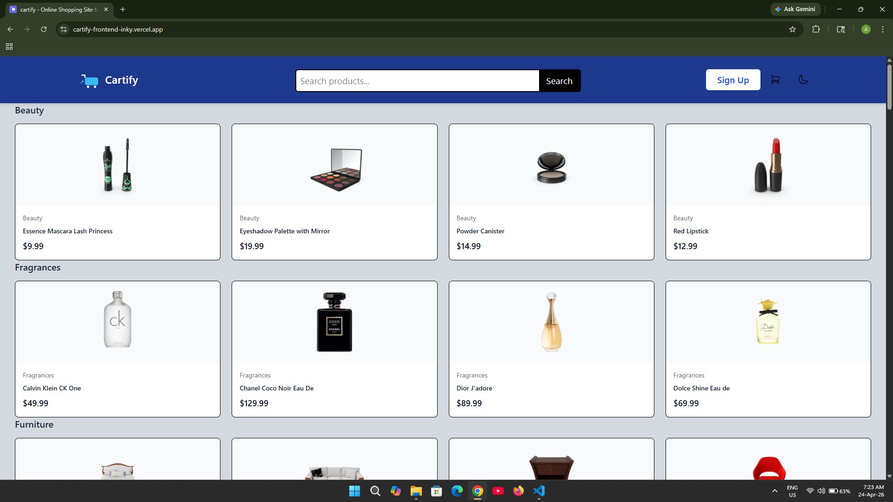
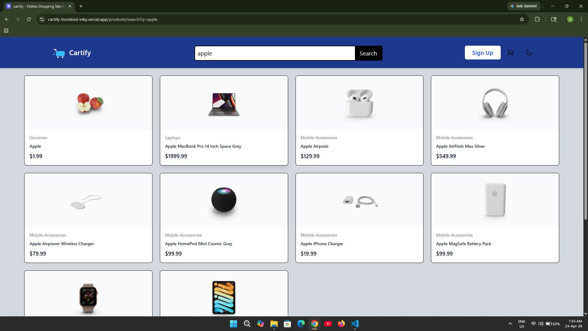
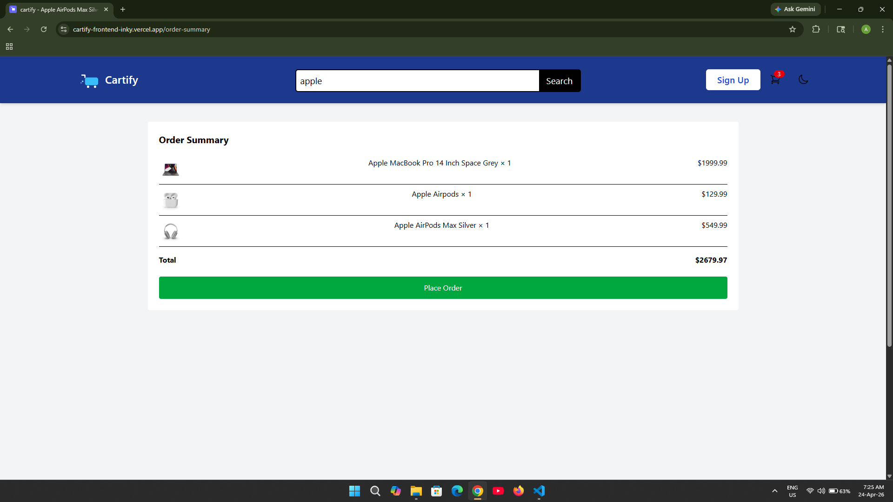
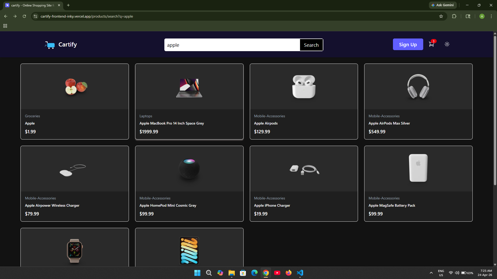
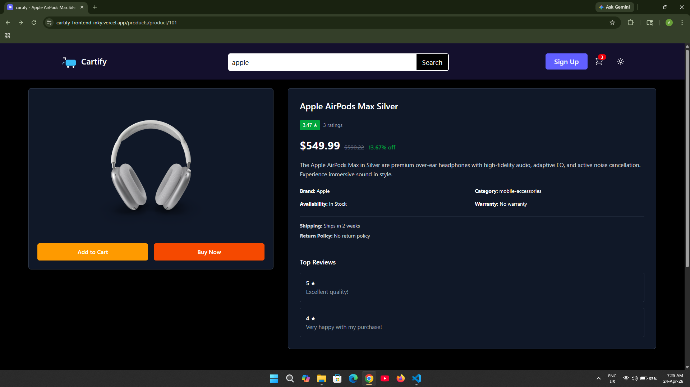
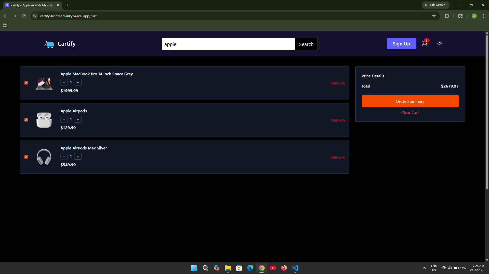
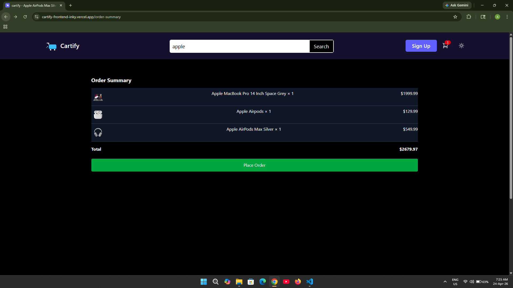

# Cartify – E-commerce Frontend Application

Cartify is a responsive e-commerce frontend application focused on delivering a smooth shopping experience with dynamic cart management and modern UI practices.

##  Live Demo

https://cartify-frontend-inky.vercel.app/

##  Overview

This project demonstrates core frontend development skills by building a functional shopping interface where users can browse products, manage a cart, and interact with a responsive UI.

##  Features

* Product listing with clean UI
* Add to cart functionality
* Update product quantity in cart
* Remove items from cart
* Real-time cart updates
* Responsive design for all devices

##  Tech Stack

* React
* Vite
* TypeScript
* Tailwind CSS
* React Router

##  Key Learnings

* Managing application state for cart functionality
* Structuring reusable React components
* Handling re-renders efficiently
* Debugging dependency and build issues
* Deploying frontend applications using Vercel

##  Installation & Setup

Clone the repository:

```bash
git clone https://github.com/Avinash-kumar-0690/e-commerce
```

Navigate to the project:

```bash
cd cartify
```

Install dependencies:

```bash
npm install
```

Run development server:

```bash
npm run dev
```

## 📦 Build for Production

```bash
npm run build
```

## 🚧 Challenges Faced

* Managing shared cart state across multiple components
* Resolving package dependency conflicts
* Fixing deployment issues
* Ensuring consistent UI responsiveness

## 🔮 Future Improvements

* Backend integration with real APIs
* User authentication system
* Payment gateway integration
* Advanced filtering and search functionality

## 📸 Screenshots

## Light Mode







## Dark Mode







## 👨‍💻 Author

Avinash Kumar
Frontend Developer (Self-taught)
